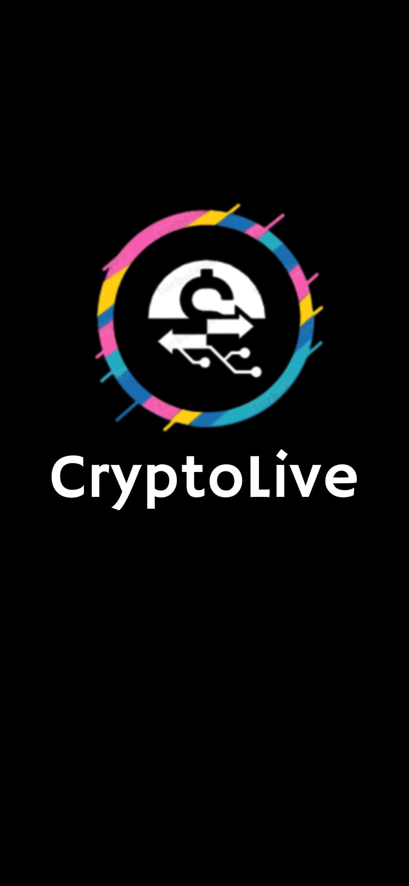
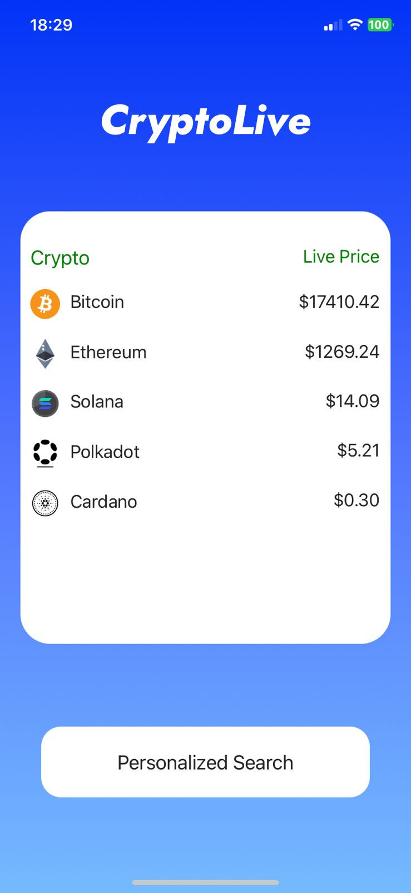
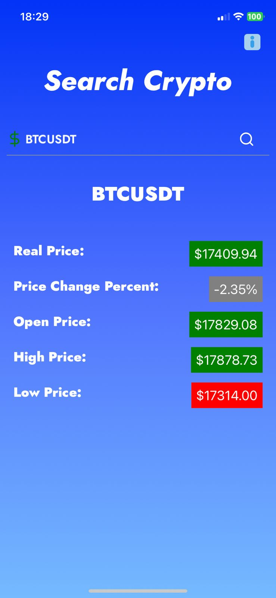

<h1 align="center">
   
  <b>CryptoLive</b> 
</h1>

  

## How to Use

The First screen, we have five cryptos and their values in realtime, in the second screen, we have a search bar to look for others cryptos, so, you have to 
insert the crypto symbol plus currency symbol, for example:    
<b>Bitcoin = BTCUSDT 
Ethereum = ETHUSDT  </b>

After you write the symbol, you have to press the symbol 🔍, after that, will be return informations of your Crypto search. 
<b>Obs: Only cryptos that are on binance</b>

## Instalation

### prerequisites

Before starting, you will need to have the following tools installed on your machine:

- <b>[Git](https://git-scm.com)</b>

- <b>[Node.js](https://nodejs.org/en/)</b>

And you will also need an editor, I use <b>[VSCode](https://code.visualstudio.com/)</b>

### Clone this Repo:

`git clone https://github.com/GolyTech/CryptoLive.git`

After that access the directory and install the dependencies by running the following command:

`cd diretório`

`yarn install # or npm install`

Running the application
`npx react-native run-android`

or
`npx react-native run-ios`

## How to contribute

- Fork this repo
- Star this repo
